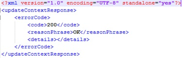

#  Aeron IoT Broker:  functional test guidelines #
# 1st DRAFT WORK IN PROGRESS VERSION! #

Aeron is the FIWARE GE reference implementation of the IoT Broker Generic Enabler by NEC available at its [GitHub repository](https://github.com/Aeronbroker/Aeron). 

## Testing environment ##
The testing environment can be easily set up through a FIWARE Lab, which is based on the cloud operating system OpenStack, and through which it is easy to create and configure a number of machines with the HW [requirements](http://fiware-iot-broker.readthedocs.io/en/latest/installadminguide/index.html#minimum-system-requirements)  needed by the GEri installation. Alternatively a different virtualisation system can be adopted as well as to prepare the overall hardware required, namely all the phisical machines needed for the test, which are:

1. A machine for the deployment of the GEri to be tested, **Aeron IoT Broker** server. Since this GEri, in order to work properly, rely on the GE **IoTDiscovery**, a mockup imlementation of the latter - available from the same owner- will be installed on the same machine.
2. A machine for **JMeter**, the tool used to inject load and for simulating the client and collecting the results generated by Aeron IoT Broker.
3. A machine for a server where to host a custom mock-up (WS application) named **iot-broker-tester** developed to simulate the missing actors needed by some test scenarios.
 
For example, in the latest test related to version 5.3 of the GEri, all the configured VMs in a dedicated FIWARE Lab were equipped with 2 CPU 2,3 GHz with 4GB RAM and 40 GB HD.

## Overall preliminary setup ##

Once the HW necessary for the test described previosly at "Testing Environmment" chapter has been setup, the following preliminary steps need to be accomplished before to start the test process:

> IoTBroker:

<!--
1. **Download** the source code of Aeron IoTBroker to the dedicated server through the command:
	`git clone --branch v5.3.3 https://github.com/Aeronbroker/Aeron.git --single-branch`
2. **Build** the component following the [GEri owner instructions](https://github.com/Aeronbroker/Aeron#building-iot-broker-source-code)
3. **Configure** Aeron IoTBroker following the [GEri owner istructions](https://github.com/Aeronbroker/Aeron#configure-the-iot-broker-with-setup-scripts).
4. **Start** the component with the script in the IoTBroker-runner folder
!-->
> IoTDiscovery:
<!--
5. **Download** the source code of NEConfman IoT Discovery to the dedicated server through the command:
	`git clone --branch v5.3.3 https://github.com/Aeronbroker/NEConfMan.git --single-branch`
6.  **Build** the component following the [GEri owner instructions](https://github.com/Aeronbroker/NEConfMan#compilation-procedure)
7.   **Configure** NEConfman IoTDiscovery following the [GEri owner istructions](https://github.com/Aeronbroker/NEConfMan#configure-the-nec-confman-with-setup-scripts).
8.   **Start** the component with the script in the ConfMan_Runner folder
-->

> JMeter:

<!--
5. **Download** [JMeter binaries](https://jmeter.apache.org/download_jmeter.cgi) 3.1 and install it into JMeter dedicated server.

> iot-broker-tester:
> 
> This component is needed for testing scenario 1 (Update Context) and scenario 2 (Query Context) as described by the [test cases documentation ](../../../tests/aeron/aeron-test-cases.md); in the former it plays the role of the Data Consumer which receives the update messages; on the latter it plays the role of Data Provider -of which the component IoTDiscovery must be made aware- which simulates a number of agents able to answer with dummy data (but contextual to each request) to the incoming queries. 

1. **Download** the code&guidelines from the [GitHub repository](../../../testers/aeron/fiware-iotbroker-tester) and go to the folder `testers/aeron/fiware-iotbroker-tester`.
2. **Compile** the code of this component through the command `mvn package` (Maven and Java must have been previously installed). An uber-JAR (jar with all dependencies) named `iotbroker-tester-x.x.x.jar`  (where x.x.x is the current version) will be created in the sub-folder `target`.
3. **Copy** the jar file `iotbroker-tester-x.x.x.jar` created at the previous step to any folder of the dedicated server for this component.
4. **Run** the java application iotbroker-tester **when required** at the proper step through the command line related to the test being carried out.
-->

##Testing step by step##

1. **Download** the JMeter plan file [`[iotbroker-updates-200t-in-1800s.jmx]`](../../../scripts/aeron/scenarios/1-update/iotbroker-updates-200t-in-1800s.jmx) and **edit** it with JMeter application or any text editor and change the value of the **`HOST` parameter** with the current address of IoTBroker server.
2. **Place** the JMeter plan file in any folder of the **JMeter server** henceforth referenced as `<updateContext-test-path>`.
3. Open a shell on IotBroker-tester server and **start** the aforementioned **mockup application** using the command:

		java –jar iotbroker-tester-1.0.5.jar data-consumer
which opens the port 8070 waiting for NGSI-10 UpdateContextRequest (from IoTBroker) and it gives back a message like the following:

	

5. Open a shell on JMeter server and **start the test** using the command `<jmeter-path>/jmeter.sh -n -t <updateContext-test-path>/iotbroker-5.4.3.jmx`
6. **Retrieve the results** of JMeter session test once it has ended. They are colleceted in a csv file which is placed in the same JMeter execution folder and named as following: `iotbroker-5.4.3_yyyy-MM-dd HHmmss.csv`

